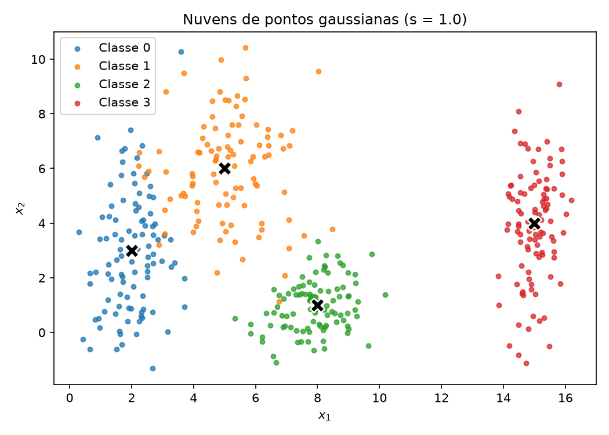
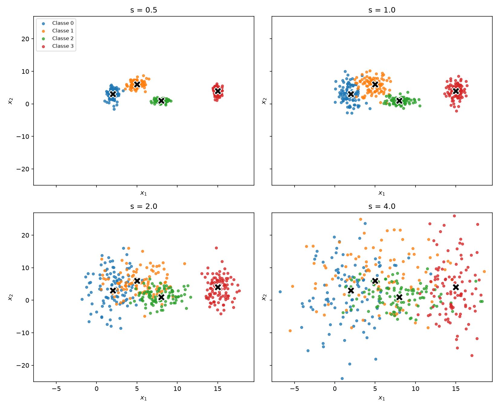
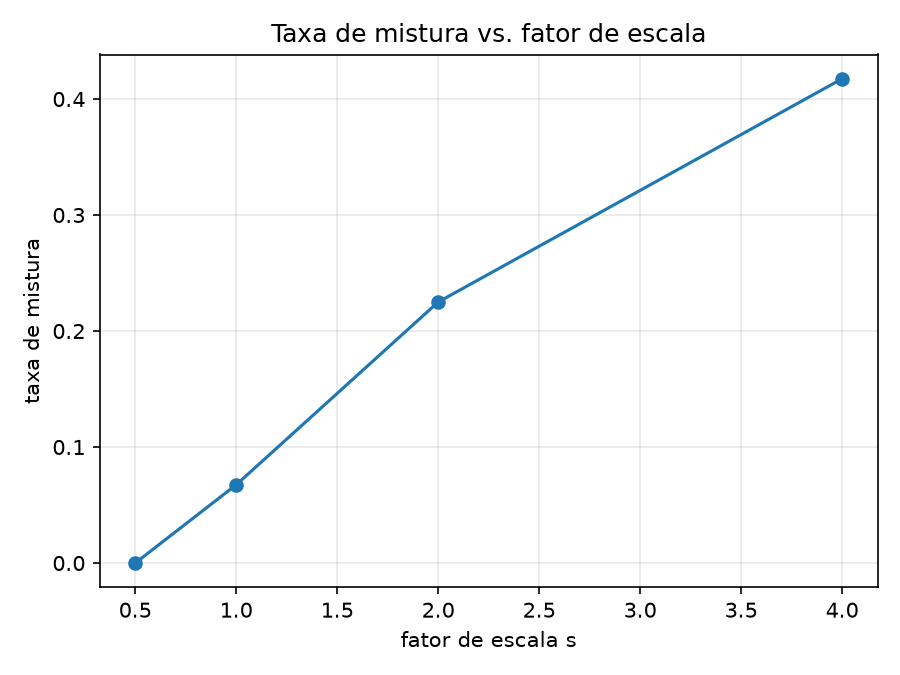
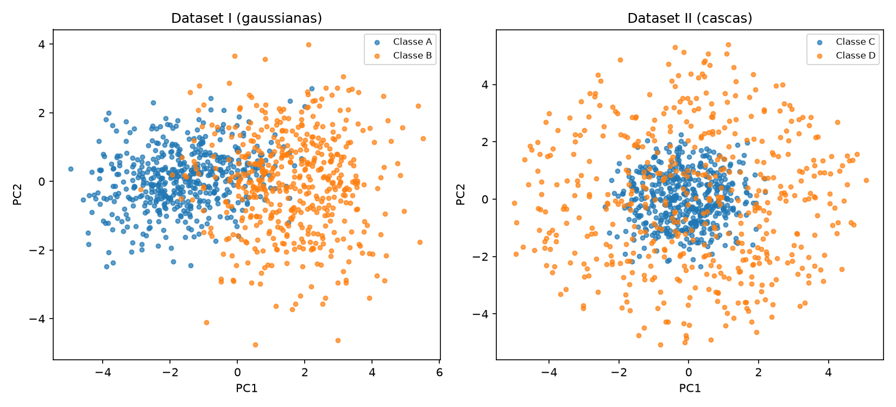
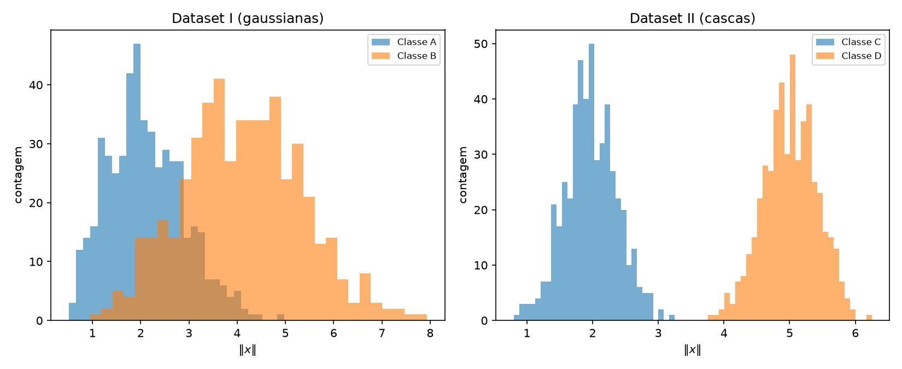
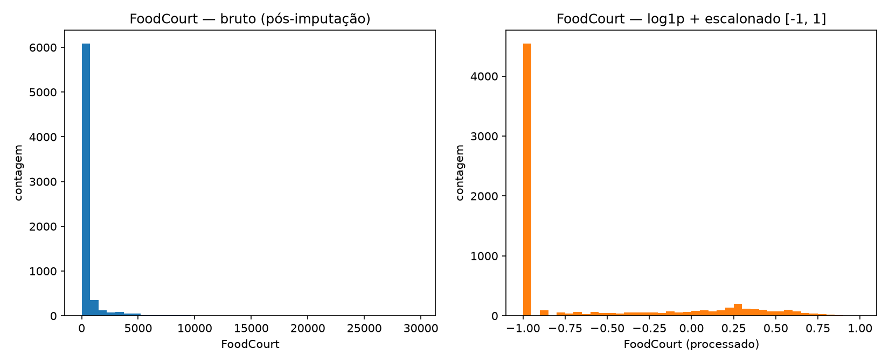

# 1. Data

Neste relatório foram gerados e analisados datasets sintéticos em duas e cinco dimensões e foi preparado o dataset Spaceship Titanic para uso futuro em uma rede neural. Todos os experimentos usam sementes fixas para garantir resultados reproduzíveis. Nenhum modelo foi treinado nesta atividade.

## Exercício 1

### A — Gere as nuvens

Foram geradas quatro classes gaussianas bidimensionais com 100 amostras por classe, totalizando 400 observações. As médias e os desvios padrão são os definidos no enunciado, e a geração utiliza `np.random.default_rng(42)` para permitir a reprodução dos resultados.

O código utilizado neste exercício está no arquivo [`exercise1_point_clouds.py`](code/exercise1_point_clouds.py).

``` { .python .copy .select linenums="1" title="docs/exercises/data/code/exercise1_point_clouds.py" }
--8<-- "docs/exercises/data/code/exercise1_point_clouds.py"
```


/// caption
**Figura 1** — Distribuição das quatro classes no plano para $s=1$. Os marcadores em formato de X representam as médias definidas no enunciado.
///

### B — Mais ou menos espalhado

Foram construídos quatro datasets usando os fatores $s \in \{0{,}5,1,2,4\}$. As médias foram mantidas e os desvios padrão foram multiplicados por $s$. Os quatro painéis usam os mesmos limites de eixos, de modo que a variação do espalhamento possa ser comparada sem distorção visual.


/// caption
**Figura 2** — Nuvens das quatro classes para $s \in \{0{,}5,1,2,4\}$. Os quatro painéis compartilham os mesmos limites de eixos.
///

A razão de separação foi calculada, para $s=1$, por

$$
r_{ij}=\frac{\lVert\mu_i-\mu_j\rVert}{\bar{\sigma}_i+\bar{\sigma}_j},
\qquad
\bar{\sigma}_k=\frac{\sigma_{k,x}+\sigma_{k,y}}{2}.
$$

| Par de classes | $r_{ij}$ em $s=1$ |
|---|---:|
| (0, 1) | 1,326 |
| (0, 2) | 2,480 |
| (0, 3) | 4,496 |
| (1, 2) | 2,380 |
| (1, 3) | 3,642 |
| (2, 3) | 3,542 |

O menor valor é **1,326**, correspondente ao par **(0, 1)**. Como as médias permanecem fixas e os desvios são multiplicados por $s$, a razão varia como $1/s$. Assim, para $s=2$, o menor valor passa a ser aproximadamente **0,663**.

A taxa de mistura é a fração dos pontos cujo centro mais próximo não pertence à classe verdadeira. Para obtê-la, cada ponto foi comparado às quatro médias por distância euclidiana, sem treinamento de modelo.

| Fator $s$ | Taxa de mistura |
|---:|---:|
| 0,5 | 0,00% |
| 1,0 | 6,75% |
| 2,0 | 22,50% |
| 4,0 | 41,75% |


/// caption
**Figura 3** — Taxa de mistura geométrica em função do fator de escala $s$.
///

Em $s=0{,}5$, as classes estão compactas e a taxa de mistura é nula na amostra gerada. Em $s=1$, já existe sobreposição, principalmente entre as classes 0 e 1, mas a maior parte dos pontos continua próxima do centro correto. A partir de $s=2$, a separação por retas deixa de ser adequada: a taxa de mistura alcança 22,50% e o menor $r_{ij}$ cai para 0,663. Em $s=4$, a mistura chega a 41,75%, indicando que uma grande parcela das observações ocupa regiões associadas a centros de outras classes.

### C — Análise

No dataset original, a sobreposição mais evidente ocorre entre as classes 0 e 1, justamente o par com o menor valor de $r_{ij}$, igual a 1,326. As classes 2 e 3 estão mais afastadas das demais, embora as distribuições gaussianas apresentem algum espalhamento em todas as direções. Uma única reta não consegue separar simultaneamente quatro classes em regiões distintas. Um conjunto de fronteiras lineares consegue criar uma separação aproximada entre as regiões, mas não classifica perfeitamente os pontos que aparecem nas áreas de sobreposição.

Para o esboço solicitado, uma escolha coerente é usar fronteiras próximas das mediatrizes entre centros vizinhos: uma entre as classes 0 e 1, outra entre 1 e 2 e uma terceira entre 2 e 3. Essas fronteiras formam regiões aproximadamente lineares, mas uma rede neural poderia deformá-las para acompanhar melhor as diferentes orientações e dispersões das nuvens.

Quando $s$ aumenta, as regiões ocupadas pelas classes passam a se interceptar com maior frequência. Nessas interseções, pontos com características muito semelhantes podem possuir rótulos diferentes, criando uma região na qual a rede inevitavelmente cometerá erros. A progressão das taxas de 0,00% para 6,75%, 22,50% e 41,75% confirma o aumento dessa região ambígua, enquanto a diminuição de $r_{ij}$ expressa a mesma perda de separação em relação ao espalhamento.

## Exercício 2

### A — Dataset I: gaussianas deslocadas

Foram geradas duas classes em cinco dimensões, com 500 amostras por classe. Foram usados os vetores médios e as matrizes de covariância fornecidos no enunciado. As covariâncias produzem espalhamentos distintos: a classe A apresenta correlação positiva forte entre as duas primeiras features, enquanto a classe B apresenta correlação negativa e variâncias maiores. A geração utiliza a semente 42.

O código utilizado no Exercício 2 está no arquivo [`exercise2_nonlinearity.py`](code/exercise2_nonlinearity.py).

``` { .python .copy .select linenums="1" title="docs/exercises/data/code/exercise2_nonlinearity.py" }
--8<-- "docs/exercises/data/code/exercise2_nonlinearity.py"
```

| Classe | Número de amostras | Número de dimensões |
|---|---:|---:|
| A | 500 | 5 |
| B | 500 | 5 |

### B — Dataset II: cascas concêntricas

Para cada classe foram sorteados 500 vetores normais em cinco dimensões. Cada vetor $v$ foi normalizado para produzir uma direção unitária,

$$
u=\frac{v}{\lVert v\rVert},
$$

e cada ponto foi construído por $x=\rho u$. Para a classe C, os raios foram sorteados de $\mathcal{N}(2{.}0,0{.}4)$; para a classe D, de $\mathcal{N}(5{.}0,0{.}4)$. Assim, as classes têm direções distribuídas pela esfera, mas ocupam faixas radiais diferentes.

| Classe | Número de amostras | Número de dimensões | Distribuição do raio |
|---|---:|---:|---|
| C | 500 | 5 | $\mathcal{N}(2{.}0,0{.}4)$ |
| D | 500 | 5 | $\mathcal{N}(5{.}0,0{.}4)$ |

### C — Visualize e compare

A PCA foi ajustada separadamente em cada dataset e as cinco dimensões foram projetadas nos dois primeiros componentes principais.


/// caption
**Figura 4** — Projeções bidimensionais obtidas por PCA para o Dataset I, formado por gaussianas deslocadas, e para o Dataset II, formado por cascas concêntricas.
///

| Dataset | PC1 | PC2 | PC1 + PC2 |
|---|---:|---:|---:|
| Dataset I — gaussianas | 50,04% | 15,93% | 65,97% |
| Dataset II — cascas | 21,59% | 21,32% | 42,91% |

A projeção do Dataset I preserva uma parcela maior da variância, 65,97%, e também mantém visível parte do deslocamento entre as médias das classes. No Dataset II, os dois componentes preservam somente 42,91% da variância e as classes aparecem bastante misturadas no plano. Portanto, para estes dados, a projeção do Dataset I preserva melhor a informação visível relevante à classificação. Ainda assim, variância explicada e informação discriminativa não são equivalentes: uma direção de baixa variância também pode conter informação útil sobre os rótulos.

As distâncias entre os centros foram calculadas no espaço original de cinco dimensões, usando as médias amostrais.

| Dataset | Distância entre os centros em 5D |
|---|---:|
| Dataset I — gaussianas | 3,228 |
| Dataset II — cascas | 0,266 |

O raio de cada observação foi calculado por

$$
\lVert x\rVert=\sqrt{x_1^2+x_2^2+x_3^2+x_4^2+x_5^2}.
$$


/// caption
**Figura 5** — Distribuição da norma euclidiana das amostras de cada classe, calculada no espaço original de cinco dimensões.
///

No Dataset I, as distribuições de raio das duas classes apresentam sobreposição considerável. A classe B tende a ter raios maiores por causa do deslocamento de sua média e de suas variâncias maiores. No Dataset II, os histogramas ficam claramente separados: a classe C se concentra em torno do raio 2 e a classe D em torno do raio 5.

### D — Análise

No Dataset II, a distância entre os centros é apenas 0,266, embora os histogramas dos raios estejam bem separados. Isso mostra que a diferença entre as classes não está em uma direção particular, mas na distância até a origem. Um hiperplano divide o espaço em dois semiespaços e não consegue colocar um núcleo aproximadamente esférico de um lado enquanto mantém uma casca que o envolve inteiramente do outro.

Coletar mais dados não torna essa estrutura linearmente separável. Novas observações apenas representam com maior precisão a mesma geometria concêntrica. A limitação está na família da fronteira de decisão, e não na quantidade de dados: seria necessária uma fronteira fechada e não linear ao redor do núcleo.

Uma projeção 2D misturada não prova que os dados são inseparáveis no espaço original. A PCA é linear, não usa os rótulos e descarta parte da informação ao manter apenas dois componentes. Isso é especialmente relevante no Dataset II, no qual PC1 e PC2 preservam 42,91% da variância. Apesar da mistura na projeção, as classes podem ser separadas no espaço original por uma função radial, por exemplo

$$
g(x)=\lVert x\rVert^2=\sum_{i=1}^{5}x_i^2.
$$

Um limiar entre os raios quadráticos típicos das classes, como $g(x)=12{,}25$, equivalente a um raio de 3,5, separa o núcleo da casca na maior parte das amostras. Essa regra é não linear nas entradas originais.

## Exercício 3

### A — Conheça os dados

Cada linha do Spaceship Titanic representa um passageiro. A coluna `Transported` indica se o passageiro foi transportado para outra dimensão durante a colisão da nave com uma anomalia espaço-temporal. Ela é o alvo binário que seria previsto em uma etapa posterior.

O código utilizado no Exercício 3 está no arquivo [`exercise3_preprocessing.py`](code/exercise3_preprocessing.py).

``` { .python .copy .select linenums="1" title="docs/exercises/data/code/exercise3_preprocessing.py" }
--8<-- "docs/exercises/data/code/exercise3_preprocessing.py"
```

| Classe `Transported` | Contagem | Proporção |
|---|---:|---:|
| `False` | 4.315 | 49,64% |
| `True` | 4.378 | 50,36% |

As classes estão praticamente balanceadas, com diferença de apenas 63 passageiros e proporções próximas de 50%.

| Tipo | Features |
|---|---|
| Numéricas | `Age`, `RoomService`, `FoodCourt`, `ShoppingMall`, `Spa`, `VRDeck` |
| Categóricas/binárias | `HomePlanet`, `CryoSleep`, `Destination`, `VIP` |
| Texto/identificação descartadas | `PassengerId`, `Cabin`, `Name` |
| Alvo | `Transported` |

`PassengerId` é um identificador, e `Name` possui alta cardinalidade sem uma representação numérica natural. `Cabin` contém informação potencialmente útil, mas exigiria uma engenharia específica para separar convés, número e lado. Como o enunciado determina seu descarte, essas três colunas não foram incluídas na matriz final.

| Coluna | Faltantes | Percentual |
|---|---:|---:|
| `PassengerId` | 0 | 0,00% |
| `HomePlanet` | 201 | 2,31% |
| `CryoSleep` | 217 | 2,50% |
| `Cabin` | 199 | 2,29% |
| `Destination` | 182 | 2,09% |
| `Age` | 179 | 2,06% |
| `VIP` | 203 | 2,34% |
| `RoomService` | 181 | 2,08% |
| `FoodCourt` | 183 | 2,11% |
| `ShoppingMall` | 208 | 2,39% |
| `Spa` | 183 | 2,11% |
| `VRDeck` | 188 | 2,16% |
| `Name` | 200 | 2,30% |
| `Transported` | 0 | 0,00% |

| Feature | Média | Mediana | Máximo |
|---|---:|---:|---:|
| `RoomService` | 224,69 | 0,00 | 14.327,00 |
| `FoodCourt` | 458,08 | 0,00 | 29.813,00 |
| `ShoppingMall` | 173,73 | 0,00 | 23.492,00 |
| `Spa` | 311,14 | 0,00 | 22.408,00 |
| `VRDeck` | 304,85 | 0,00 | 24.133,00 |

Em todas as colunas de gasto, a mediana é zero, enquanto a média é positiva e o máximo é muito superior à média. Isso indica grande concentração de passageiros sem gastos e uma minoria com valores muito altos. As distribuições são fortemente assimétricas à direita e possuem caudas pesadas.

### B — Separe antes de transformar

Foi realizada uma separação estratificada, reservando 80% das observações para treino e 20% para teste, com `random_state=42`.

| Conjunto | Número de amostras | Proporção positiva |
|---|---:|---:|
| Treino | 6.954 | 50,36% |
| Teste | 1.739 | 50,37% |

A separação precisa ocorrer antes da imputação, codificação e normalização porque essas operações calculam estatísticas ou aprendem categorias dos dados. Ajustá-las no conjunto completo permitiria que informações do teste influenciassem o treino, caracterizando vazamento de dados e produzindo uma avaliação excessivamente otimista.

### C — Pré-processe

Para as colunas numéricas, os valores ausentes foram substituídos pela mediana calculada somente no treino. A mediana é menos sensível a valores extremos e, por isso, é apropriada para as colunas de gasto assimétricas. Nas colunas categóricas, foi usada a categoria mais frequente do treino, preservando valores válidos do domínio sem criar uma categoria artificial. Os mesmos imputadores ajustados no treino foram aplicados ao teste.

As colunas `HomePlanet`, `CryoSleep`, `Destination` e `VIP` foram convertidas por one-hot encoding.

| Verificação | Resultado |
|---|---:|
| Colunas categóricas originais | 4 |
| Colunas produzidas pelo one-hot | 10 |
| Categorias desconhecidas que causam erro | 0 |

O parâmetro `handle_unknown="ignore"` faz com que uma categoria presente somente no teste seja representada por zeros nas colunas conhecidas daquela feature, em vez de interromper a transformação. Isso permite aplicar o mesmo encoder a novos dados sem ajustá-lo novamente.

A feature `TotalSpend` foi definida como

$$
\text{TotalSpend}=\text{RoomService}+\text{FoodCourt}+\text{ShoppingMall}+\text{Spa}+\text{VRDeck}.
$$

Ela resume em um único valor o gasto total do passageiro nos cinco serviços da nave. `PassengerId`, `Cabin` e `Name` não foram incluídas na matriz final.

Nas cinco colunas de gasto e em `TotalSpend`, foi aplicada a transformação

$$
x_{\mathrm{log}}=\log(1+x).
$$

O uso de $\log(1+x)$ preserva os zeros e comprime valores muito altos, reduzindo a influência da cauda direita. Isso diminui diferenças extremas de magnitude antes do escalonamento. Para uma rede com `tanh`, entradas menos extremas reduzem a chance de ativações permanecerem nas regiões saturadas, onde o gradiente é pequeno.

Depois da transformação logarítmica, as features numéricas foram normalizadas com `MinMaxScaler(feature_range=(-1, 1))`, ajustado apenas no treino.

| Conjunto | Mínimo final | Máximo final |
|---|---:|---:|
| Treino | -1,000 | 1,000 |
| Teste | -1,000 | 1,138 |

O máximo do teste ultrapassa 1 porque existe uma observação fora dos extremos vistos durante o ajuste no treino. Esse resultado não representa vazamento: manter os parâmetros do treino é justamente o procedimento correto. O valor 1,138 ainda possui magnitude próxima do intervalo da `tanh`; alternativamente, seria possível usar `clip=True` para impor estritamente os limites, assumindo a perda da diferença entre valores que excedem os extremos do treino.

### D — Verifique e visualize


/// caption
**Figura 6** — Distribuição de `FoodCourt` no conjunto de treino antes do pré-processamento e depois da transformação $\log(1+x)$ e do escalonamento.
///

Antes da transformação, a distribuição apresenta uma concentração muito grande em zero e uma cauda longa que chega a dezenas de milhares. Depois de `log1p` e do escalonamento, os valores altos são comprimidos e os valores não nulos ficam distribuídos em uma faixa muito menor. A concentração associada aos gastos iguais a zero permanece próxima de -1, pois a transformação preserva o significado desses zeros.

| Checagem | Treino | Teste |
|---|---:|---:|
| Quantidade de `NaN` | 0 | 0 |
| Número de amostras | 6.954 | 1.739 |
| Número de features | 17 | 17 |
| Valor mínimo | -1,000 | -1,000 |
| Valor máximo | 1,000 | 1,138 |

Não restaram valores `NaN`. As matrizes finais possuem shapes `X_train = (6954, 17)` e `X_test = (1739, 17)`. O treino ocupa exatamente o intervalo $[-1,1]$, enquanto o teste alcança 1,138 por conter um valor superior ao máximo observado no treino. Em geral, as magnitudes continuam próximas do intervalo de operação da `tanh`, mas essa extrapolação deve ser registrada ao interpretar o pré-processamento.

As decisões com maior impacto provável sobre o treinamento são a transformação logarítmica e o escalonamento. A `log1p` reduz a influência de poucos gastos extremamente elevados, evitando que eles dominem as diferenças entre passageiros. O escalonamento aproxima as features numéricas do intervalo da `tanh`, favorecendo ativações fora das regiões mais saturadas. A separação anterior às transformações também é essencial para que essas melhorias não sejam acompanhadas por vazamento de informação do teste.

## Resumo dos resultados

| # | Item | Seu valor |
|---:|---|---|
| 1 | Taxa de mistura em $s=0{,}5$ | 0,00% |
| 2 | Taxa de mistura em $s=1{,}0$ | 6,75% |
| 3 | Taxa de mistura em $s=2{,}0$ | 22,50% |
| 4 | Taxa de mistura em $s=4{,}0$ | 41,75% |
| 5 | Menor $r_{ij}$ em $s=1{,}0$, e qual é o par | 1,326; par (0, 1) |
| 6 | Distância entre os centros — Dataset I | 3,228 |
| 7 | Distância entre os centros — Dataset II | 0,266 |
| 8 | Variância explicada PC1 + PC2 — Dataset I | 65,97% |
| 9 | Variância explicada PC1 + PC2 — Dataset II | 42,91% |
| 10 | Proporção da classe positiva em `Transported` | 50,36% |
| 11 | Média e mediana de `FoodCourt` no treino, antes de transformar | 452,61 e 0,00 |
| 12 | `shape` final da matriz de features de treino | `(6954, 17)` |
| 13 | Mínimo e máximo do treino e do teste após o escalonamento | treino: -1,000 e 1,000; teste: -1,000 e 1,138 |
