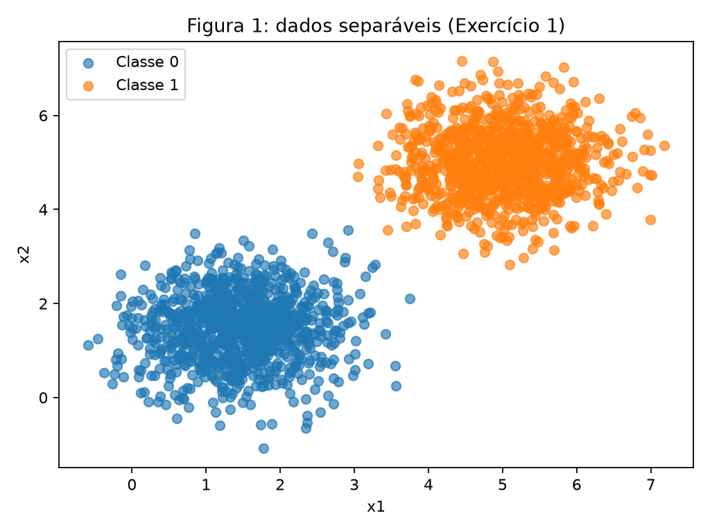
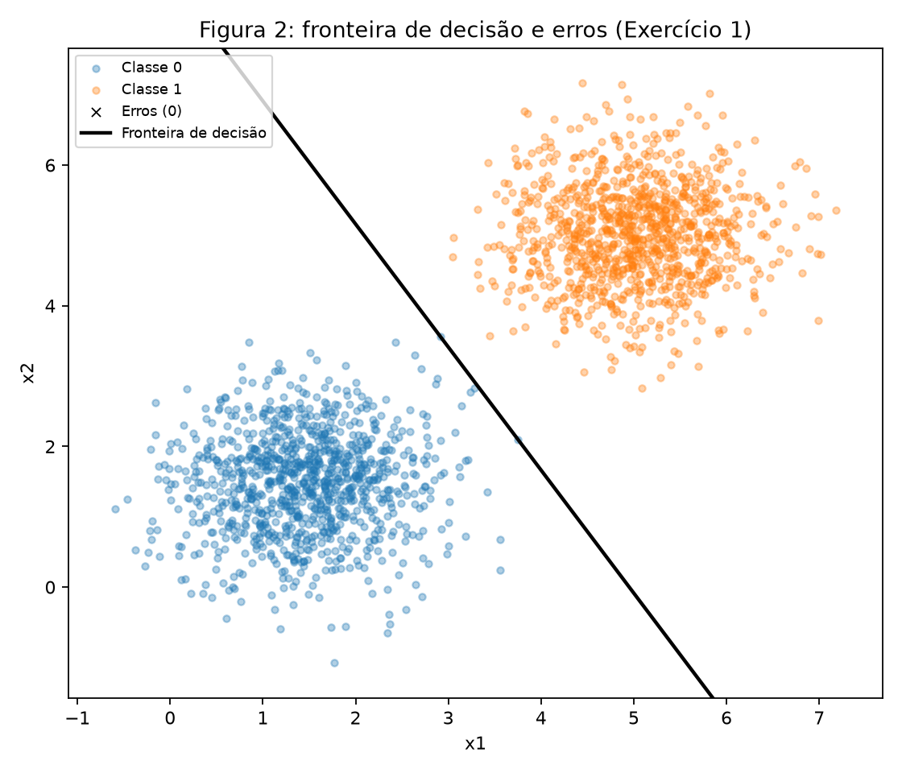
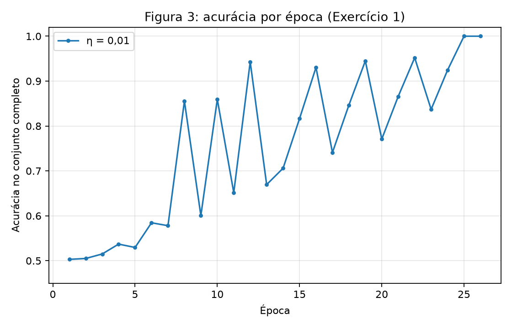
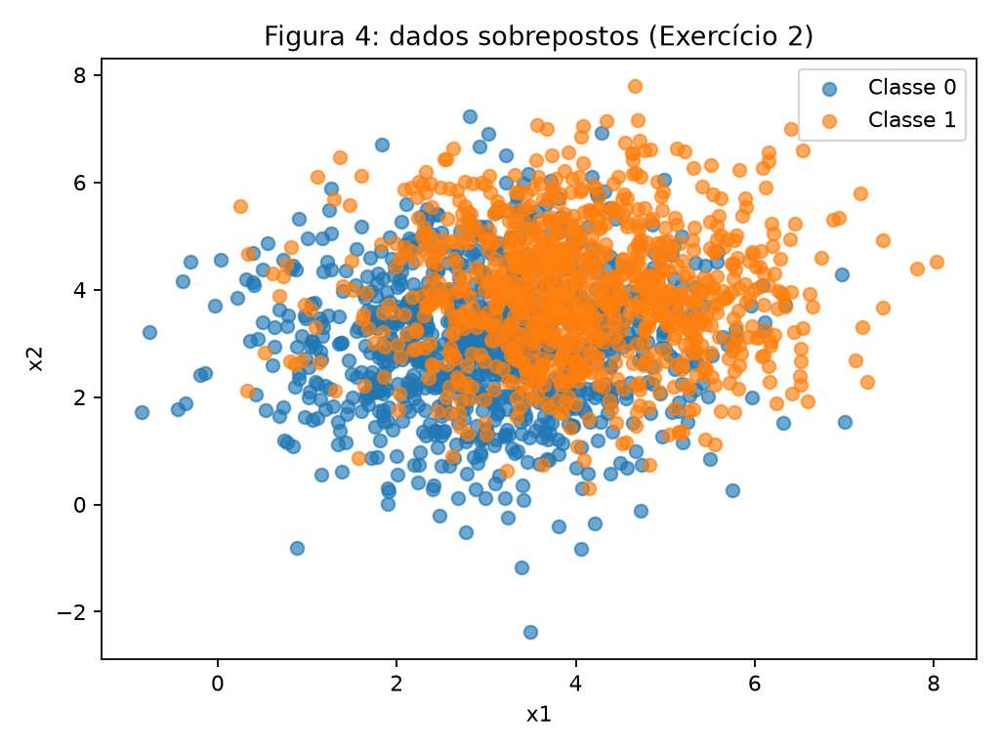
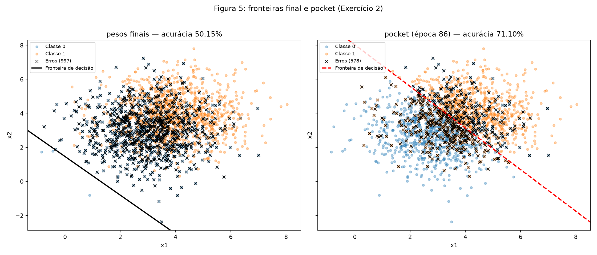
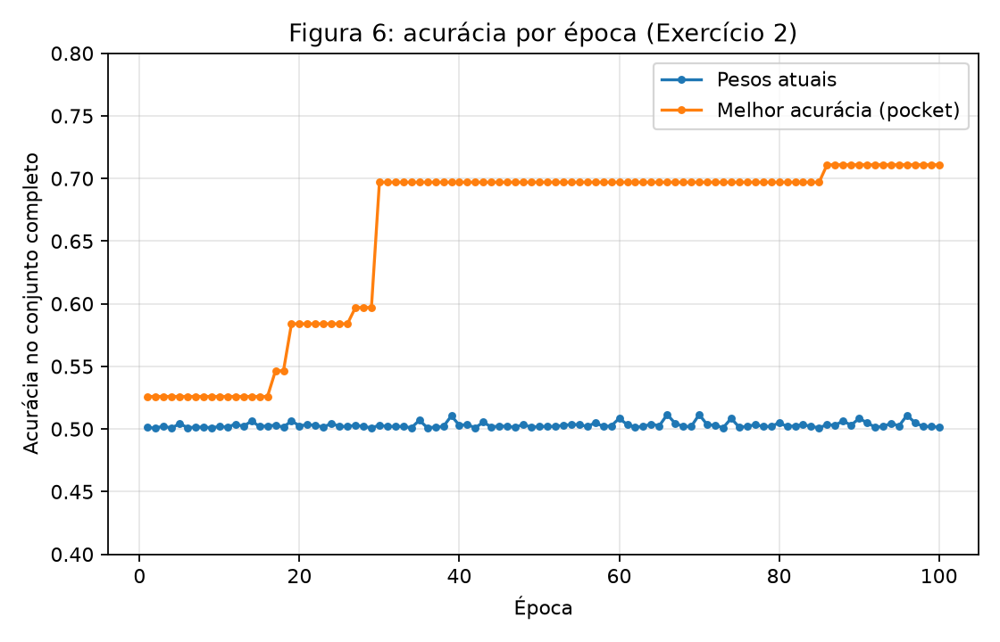

# 2. Perceptron

Neste relatório foi implementado do zero um perceptron de uma camada, treinado primeiro em dados bidimensionais linearmente separáveis e depois em dados sobrepostos, nos quais foi acrescentado o algoritmo *pocket*. Todos os experimentos usam `np.random.default_rng(42)`, o mesmo gerador em todo o relatório, para garantir resultados reproduzíveis. Foram usadas apenas as bibliotecas NumPy e Matplotlib, sem nenhum modelo pronto. Os pontos são processados na ordem em que aparecem no dataset, sem embaralhamento. O principal desafio foi acrescentar o *pocket* após cada atualização sem duplicar a regra de aprendizado do perceptron; isso foi resolvido com uma função de retorno chamada apenas quando ocorre uma correção.

## Exercício 1

### A — Gere os dados

Foram geradas duas classes gaussianas bidimensionais com 1.000 amostras por classe, totalizando 2.000 observações. A classe 0 tem média $[1{,}5,\ 1{,}5]$ e a classe 1 tem média $[5,\ 5]$, ambas com covariância $0{,}5\,I$.


/// caption
**Figura 1** — Distribuição das duas classes do Exercício 1, com uma cor por classe.
///

### B — Implemente o perceptron

A predição é dada por

$$
\hat y = \begin{cases}1 & \text{se } w \cdot x + b \geq 0,\\0 & \text{caso contrário,}\end{cases}
$$

e os parâmetros são atualizados a cada ponto pela regra

$$
w \leftarrow w + \eta(y-\hat y)x, \qquad b \leftarrow b + \eta(y-\hat y).
$$

Os pesos foram inicializados com `rng.normal(0, 0.01, size=2)` e o bias com $b=0$. Foi usada taxa de aprendizado $\eta=0{,}01$ e limite de 100 épocas, com parada antecipada se uma época completa terminar sem nenhuma atualização. A acurácia no conjunto completo é registrada ao final de cada época, após percorrer os pontos na ordem do dataset.

O código utilizado neste relatório está no arquivo [`exercise.py`](code/exercise.py). A regra de atualização fica em uma única função, `_epoch_pass`, compartilhada pelo treino simples e pelo treino com *pocket* do Exercício 2, de modo que a implementação do Exercício 1 não é alterada.

``` { .python .copy .select linenums="1" title="docs/exercises/perceptron/code/exercise.py" }
--8<-- "docs/exercises/perceptron/code/exercise.py"
```

### C — Treine e meça

| Item | Valor |
|---|---|
| Pesos iniciais | $[0{,}00253,\ 0{,}00895]$ |
| Pesos finais $w$ | $[0{,}05050,\ 0{,}02887]$ |
| Bias final $b$ | $-0{,}25$ |
| Épocas executadas | 26 |
| Acurácia final | 100,00% |

Ocorreram 73 atualizações no total. Nas primeiras 25 épocas houve de uma a quatro correções por passagem; ao final da época 25 a acurácia chegou a 100%. A época 26 não teve nenhuma atualização e confirmou a convergência. Não restaram pontos classificados incorretamente.


/// caption
**Figura 2** — Pontos e fronteira de decisão $w\cdot x+b=0$. Nenhum ponto foi classificado incorretamente.
///


/// caption
**Figura 3** — Acurácia no conjunto completo ao final de cada época para $\eta=0{,}01$.
///

### D — Análise

**1. Convergência rápida.** As médias das classes estão a $3{,}5\sqrt{2}\approx 4{,}95$ unidades uma da outra e cada eixo tem desvio padrão de apenas $\sqrt{0{,}5}\approx 0{,}71$, de modo que existe uma margem larga entre as nuvens. Em dados linearmente separáveis com margem, o perceptron realiza um número finito de correções. Nesta execução foram 73 atualizações distribuídas pelas primeiras 25 épocas. A contagem não precisa cair de forma monotônica — aqui variou entre uma e quatro correções por época devido à ordem fixa das classes —, mas os erros desaparecem à medida que a fronteira encontra uma região separadora. Na época 26 a contagem chegou a zero, que é o critério de parada.

**2. Efeito de $\eta=1{,}0$.** O treino foi repetido com os mesmos pesos iniciais e a mesma ordem dos pontos.

| | $\eta=0{,}01$ | $\eta=1{,}0$ |
|---|---:|---:|
| Épocas | 26 | 37 |
| Atualizações totais | 73 | 101 |
| Acurácia final | 100,00% | 100,00% |
| $w$ | $[0{,}05050,\ 0{,}02887]$ | $[5{,}87062,\ 3{,}35924]$ |
| $b$ | $-0{,}25$ | $-31{,}0$ |
| $w/\lVert w\rVert$ | $[0{,}86812,\ 0{,}49635]$ | $[0{,}86795,\ 0{,}49665]$ |

O cosseno entre as duas direções é 0,99999994, correspondente a um ângulo de apenas 0,02°. Apesar das direções quase iguais, as fronteiras não são idênticas: elas cruzam a diagonal $x_1=x_2$ em aproximadamente 3,15 e 3,36. A taxa de aprendizado multiplica cada correção. Com $\eta=0{,}01$, a inicialização de norma 0,009 ainda deixa uma pequena contribuição aditiva nos parâmetros; com $\eta=1{,}0$, ela se torna desprezível diante de $\lVert w\rVert\approx 6{,}76$. Por isso as duas execuções chegam a 100%, mas com escalas, contagens de atualizações e fronteiras diferentes.

**3. Inicialização nula.** Com $w_0=0$ e $b_0=0$, pode-se escrever $w_t=\eta u_t$ e $b_t=\eta v_t$, com $u_0=0$ e $v_0=0$. A predição

$$
\hat y_t=\mathbb{1}\left[\eta\,(u_t\cdot x+v_t)\geq 0\right]
$$

não depende de $\eta>0$, portanto o erro $e_t=y-\hat y_t$ é o mesmo para qualquer taxa, dada a mesma ordem dos pontos. A atualização torna-se

$$
\eta u_{t+1}=\eta u_t+\eta e_t x
\;\Rightarrow\;
u_{t+1}=u_t+e_t x,
\qquad
v_{t+1}=v_t+e_t,
$$

sem qualquer dependência de $\eta$. Por indução, $w_t(\eta_2)=\dfrac{\eta_2}{\eta_1}\,w_t(\eta_1)$ e $b_t(\eta_2)=\dfrac{\eta_2}{\eta_1}\,b_t(\eta_1)$ para todo $t$. Como o sinal de $w\cdot x+b$ é preservado, a fronteira, a sequência de erros e o número de épocas são idênticos. A verificação numérica, percorrendo os pontos na mesma ordem, confirma o resultado.

| $\eta$ | $w$ | $b$ | Épocas |
|---:|---|---:|---:|
| 0,01 | $[0{,}05868,\ 0{,}03350]$ | $-0{,}31$ | 37 |
| 0,5 | $[2{,}93404,\ 1{,}67514]$ | $-15{,}5$ | 37 |
| 1,0 | $[5{,}86808,\ 3{,}35029]$ | $-31{,}0$ | 37 |

A razão entre os parâmetros de $\eta=1{,}0$ e $\eta=0{,}01$ é exatamente 100, tanto em $w$ quanto em $b$.

## Exercício 2

### A — Gere os dados

Foram geradas novamente duas classes com 1.000 amostras cada, agora com covariância $1{,}5\,I$. A classe 0 tem média $[3,\ 3]$ e a classe 1 tem média $[4,\ 4]$. A distância entre as médias é $\sqrt{2}\approx 1{,}41$, menor que o desvio padrão de cada eixo, $\sqrt{1{,}5}\approx 1{,}22$, o que produz uma sobreposição intensa.


/// caption
**Figura 4** — Distribuição das duas classes do Exercício 2, com uma cor por classe.
///

### B — Treine guardando os melhores pesos

Foi reutilizada a mesma regra de atualização do Exercício 1, com $\eta=0{,}01$ e limite de 100 épocas. Depois de cada correção, a acurácia dos parâmetros atuais é calculada no conjunto completo. Se ela supera estritamente a melhor já registrada, são guardadas cópias de $w$, $b$ e a época correspondente. Este é o algoritmo *pocket*.

| Parâmetros | $w$ | $b$ | Acurácia |
|---|---|---:|---:|
| Finais (época 100) | $[0{,}05448,\ 0{,}04804]$ | $-0{,}07$ | 50,15% |
| *Pocket* (época 86) | $[0{,}01066,\ 0{,}00873]$ | $-0{,}07$ | 71,10% |

O treino não chegou a nenhuma época sem atualizações: ocorreram de duas a cinco correções por época, com média de 2,89. Como os dados estão organizados com toda a classe 0 antes da classe 1, o fim de cada época é dominado pelas últimas correções da classe 1. A acurácia dos pesos atuais ao final das épocas ficou entre 50,05% e 51,15%, com média de 50,31%. Nas cinco últimas épocas ela foi de 51,10%, 50,50%, 50,20%, 50,20% e 50,15%. Portanto, o valor final reflete onde a última atualização deixou a fronteira, e não uma convergência. Como referência, o classificador linear ótimo para estas distribuições, cuja fronteira é $x_1+x_2=7$, acerta cerca de 71,8%, valor próximo ao alcançado pelo *pocket*.

### C — Figuras


/// caption
**Figura 5** — Fronteira e erros dos pesos finais no painel esquerdo; fronteira e erros do *pocket* no painel direito. Os painéis usam os mesmos dados e limites de eixos.
///


/// caption
**Figura 6** — Acurácia dos pesos atuais e melhor acurácia do *pocket* até cada época.
///

### D — Análise

**1. Pesos finais e pocket.** O *pocket* alcançou 71,10%, contra 50,15% dos pesos finais, uma diferença de 20,95 pontos percentuais. Em cada erro o bias muda $\pm\eta=\pm0{,}01$, enquanto $w$ muda $\pm\eta x$, um passo de norma aproximadamente $\eta\lVert x\rVert=0{,}051$, pois a norma média dos pontos é 5,11. Como os vetores mudam cerca de cinco vezes mais que o bias, poucas correções deslocam e giram bastante a fronteira. Além disso, cada época termina percorrendo a classe 1: as últimas correções empurram a fronteira para a borda inferior esquerda da nuvem. A fronteira final fica a apenas 0,96 da origem e classifica 99,85% dos pontos como classe 1, o que explica a acurácia próxima de 50%. A fronteira do *pocket* fica a 5,08 da origem, próxima de 4,95 para a fronteira ótima. O *pocket* preserva esse estado intermediário antes que as atualizações seguintes o destruam.

**2. Figuras 3 e 6.** Na Figura 3 a acurácia progride até 100% e o treino termina na época 26, depois de uma passagem sem atualizações. Na Figura 6 a acurácia dos pesos atuais permanece perto de 50% ao final das 100 épocas, enquanto a melhor acurácia do *pocket* só pode crescer. O teorema de convergência do perceptron garante que, se existe um hiperplano que separa as classes com margem $\gamma>0$ e $\lVert x\rVert\le R$, o algoritmo realiza no máximo $(R/\gamma)^2$ atualizações e termina com zero erros. No Exercício 2 a hipótese não satisfeita é a separabilidade linear. Os centros estão a apenas 1,41 e o desvio padrão é 1,22, de modo que nenhuma reta separa as classes (mesmo a melhor erra cerca de 28% dos pontos) e não existe $\gamma>0$.

**3. Mais épocas ou taxa menor.** A regra de atualização só depende do sinal do erro: enquanto existir um ponto errado, $w$ e $b$ continuam mudando por $\eta(y-\hat y)x$ e $\eta(y-\hat y)$. Como os erros são inerentes à sobreposição dos dados, nenhum número de épocas os elimina. A verificação numérica usou $w=0$ e a mesma ordem dos pontos.

| Configuração | Melhor acurácia (*pocket*) | Época do *pocket* | Acurácia final |
|---|---:|---:|---:|
| $\eta=0{,}01$, 100 épocas | 71,50% | 89 | 50,35% |
| $\eta=0{,}001$, 100 épocas | 71,50% | 89 | 50,35% |
| $\eta=0{,}01$, 1.000 épocas | 71,65% | 193 | 50,15% |

Com $\eta=0{,}001$ o resultado é idêntico ao de $\eta=0{,}01$: $w$ e $b$ ficam exatamente 10 vezes menores e a fronteira é a mesma (cosseno igual a 1), como demonstrado no item 3 do Exercício 1. Com 10 vezes mais épocas, o melhor *pocket* melhora apenas 0,15 ponto percentual e os pesos finais continuam perto de 50%. Assim, uma taxa menor apenas reescala os passos e mais épocas apenas prolongam a oscilação. Resolver a sobreposição exigiria mudar o modelo ou a função de perda, e não o treino do perceptron.

## Resumo dos resultados

| # | Métrica | Valor |
|---:|---|---|
| 1 | Exercício 1 — pesos e bias finais | $w=[0{,}05050,\ 0{,}02887]$, $b=-0{,}25$ |
| 2 | Exercício 1 — épocas até convergir | 26 (73 atualizações no total; 0 na época 26) |
| 3 | Exercício 1 — acurácia final | 100,00% |
| 4 | Exercício 1 — épocas e acurácia com $\eta=1{,}0$ | 37 épocas; 100,00% |
| 5 | Exercício 2 — pesos e bias finais | $w=[0{,}05448,\ 0{,}04804]$, $b=-0{,}07$ |
| 6 | Exercício 2 — acurácia dos pesos finais | 50,15% |
| 7 | Exercício 2 — acurácia dos pesos do pocket | 71,10% |
| 8 | Exercício 2 — época em que ocorreu o melhor pocket | 86 |
